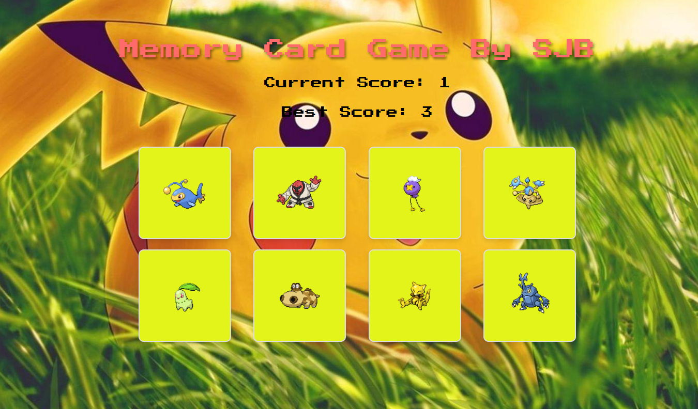

---

# Memory Card Game 🃏

A fun and interactive memory card game where players test their memory by selecting unique cards without repetition. If a card is selected twice, the game resets, but the player can try again to beat their best score!

## Features ✨
- **Dynamic Gameplay:** Cards shuffle after every selection.
- **Score Tracking:** Keep track of your current and best scores.
- **Toast Notification:** Get a fun notification when you lose.
- **Pokémon Theme:** Features Pokémon cards fetched dynamically from the Pokémon API.
- **Responsive Design:** Adapted for different screen sizes.

## Tech Stack 🛠️
- **React.js:** Front-end framework for building UI components.
- **CSS:** For styling and responsive design.
- **Pokémon API:** To fetch dynamic images for the cards.

## Installation & Setup ⚙️
1. **Clone the Repository:**
   ```bash
   git clone https://github.com/your-username/MemoryCard.git
   ```
2. **Navigate to the Project Directory:**
   ```bash
   cd MemoryCard
   ```
3. **Install Dependencies:**
   ```bash
   npm install
   ```
4. **Run the Application:**
   ```bash
   npm start
   ```
   The application will run on [http://localhost:3000](http://localhost:3000).

## How to Play 🎮
1. Select a card to start the game.
2. The cards will shuffle after every selection.
3. **Objective:** Keep selecting unique cards without repetition.
4. If you select a card twice, the game resets, and your current score goes back to zero.
5. Try to beat your best score!

## Preview 📸


## Future Enhancements 🚀
- Add more themes and card designs.
- Include difficulty levels (e.g., more cards for advanced players).
- Implement a timer mode for added challenge.
- Add sound effects for clicks and game events.

## Contributing 🤝
Contributions are welcome!  
1. Fork the repository.
2. Create a new branch:
   ```bash
   git checkout -b feature-name
   ```
3. Commit your changes:
   ```bash
   git commit -m "Added new feature"
   ```
4. Push to the branch:
   ```bash
   git push origin feature-name
   ```
5. Open a Pull Request.

## License 📄
This project is licensed under the [MIT License](LICENSE).

---

Feel free to modify this to include more details or personal touches!